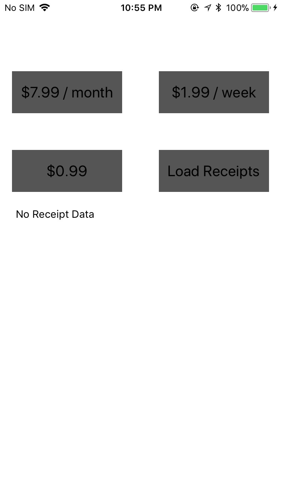
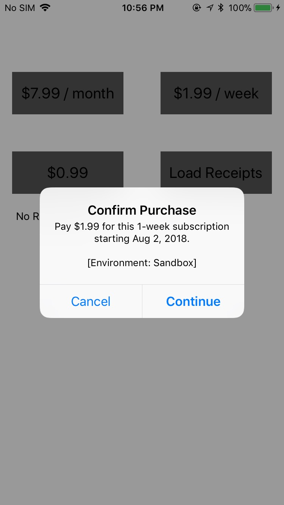

# apple-test-app

This is a very simple iOS app to test in-app purchase & subscriptions. On successful transaction, the app will display receipt data. Existing receipts can be retrieved with `Load Receipts` button.

## App Setup & Build

1. Clone this repo and open the project in XCode.
1. In the general section, make sure to check `Automatically manage signing`, select your Apple ID from the dropdown for Team, and modify the Bundle Identifier to something like `com.yourCompany.IAPTest`.
1. In the capabilities section, make sure that the In-App Purchase capability is turned on.
1. In your App Store Connect account, create an app and select the Bundle Identifier from the dropdown that matches the one you created in a previous step.
1. Under the `Features` section, create up to 3 in-app purchase products with the following `productID`s:
    - com.entitled.IAPTest.iap.onetime
    - com.entitled.IAPTest.ias.weekly    
    - com.entitled.IAPTest.ias.monthly
1. Add the subscription products to the same group.
1. Build your app to your external device.

## Testing

Testing can be done on physical iOS devices.  It wil require a special sandbox testing AppleID. *DO NOT* log in to the Apple Store or your device's Settings with your sandbox AppleID. Only sign in with the sandbox AppleID when prompted to buy something on your test build.

On a successful purchase, the text area in the screen will display the Apple receipt that can be used for verification.
